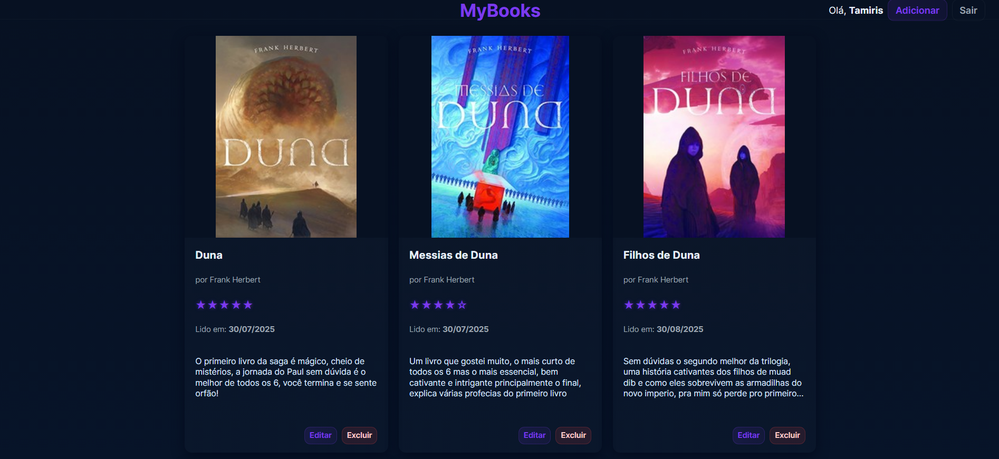
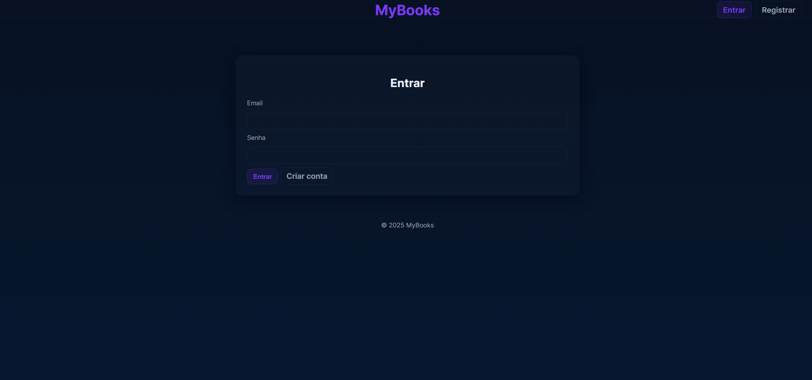
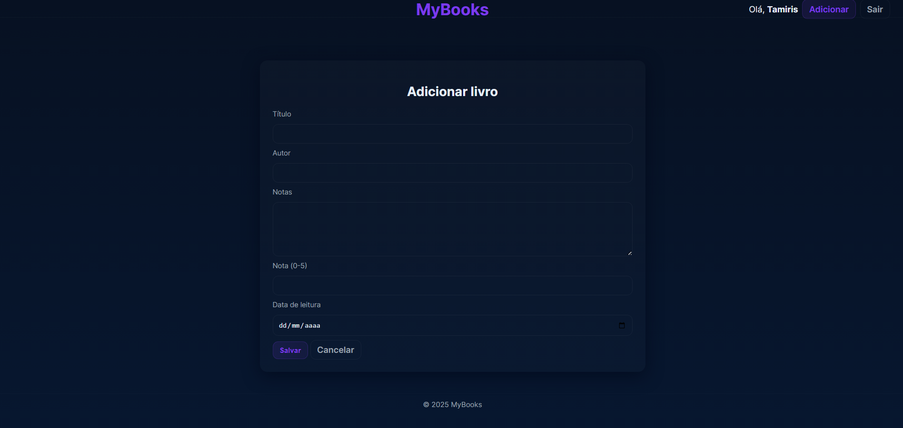
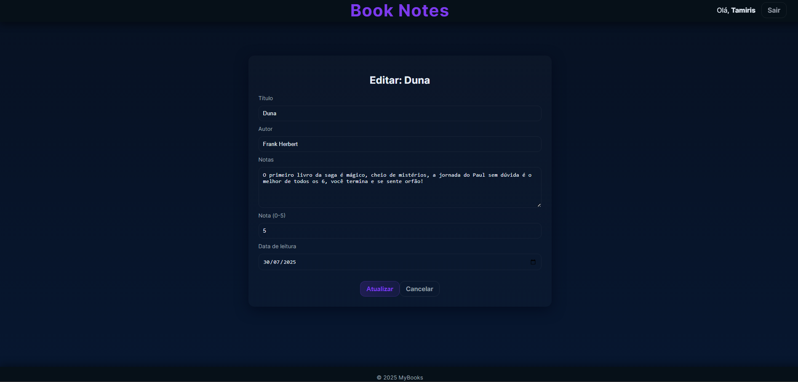

BookNotes

Aplicação web para organização de livros lidos.
Permite registrar usuários, fazer login, adicionar livros, editar, excluir, visualizar notas e pesquisar.
As capas são buscadas automaticamente pelas APIs OpenLibrary e Google Books e salvas no banco para carregamento rápido.

Screenshots

Recursos do projeto:

Autenticação completa (registro, login, logout)
Criptografia de senha com bcrypt
Capas automáticas usando OpenLibrary + Google Books
Salvamento de capa no banco (cover_url)
CRUD completo de livros
Layout com EJS e express-ejs-layouts
Pesquisa por título e autor
Interface responsiva
Sessões com express-session
Arquitetura simples e organizada
Tecnologias utilizadas
Node.js
Express
EJS
express-ejs-layouts
PostgreSQL (pg)
Passport (Local Strategy)
bcrypt
node-fetch
dotenv

Como rodar o projeto:

1. Clonar o repositório
git clone https://github.com/seu-usuario/booknotes.git
cd booknotes

2. Instalar dependências
npm install

3. Criar o banco de dados

No PostgreSQL:

CREATE TABLE users (
  id SERIAL PRIMARY KEY,
  name VARCHAR(255),
  email VARCHAR(255) UNIQUE,
  password TEXT,
  google_id VARCHAR(255),
  created_at TIMESTAMP DEFAULT NOW()
);

CREATE TABLE books (
  id SERIAL PRIMARY KEY,
  user_id INTEGER REFERENCES users(id) ON DELETE CASCADE,
  title VARCHAR(255) NOT NULL,
  author VARCHAR(255),
  notes TEXT,
  rating INTEGER,
  read_date DATE,
  cover_url TEXT,
  created_at TIMESTAMP DEFAULT NOW()
);

4. Criar o arquivo .env na raiz
PORT=3000

DB_USER=postgres
DB_HOST=localhost
DB_NAME=booknotes
DB_PASSWORD=sua_senha
DB_PORT=suaporta

SESSION_SECRET=uma_senha_segura

(O login com Google é opcional)

5. Iniciar o servidor
npm run dev ou node index.js

Acesse:

http://localhost:3000

Estrutura do projeto

index.js,
package.json,
public/style.css,
views/layout.ejs, index.ejs, login.ejs, register.ejs, addBook.ejs, editBook.ejs, deleteBook.ejs

Principais habilidades desenvolvidas nesse projeto:

Autenticação e sessões em Node.js
Integração com APIs externas
Criptografia de dados sensíveis
Manipulação de banco relacional
Criação de interface com EJS
Responsividade completa
Organização e modularização de código
Utilização de variáveis de ambiente
Fluxo básico de deploy e Git
Status do projeto

Em desenvolvimento contínuo, funcionalidades principais prontas e estáveis.
