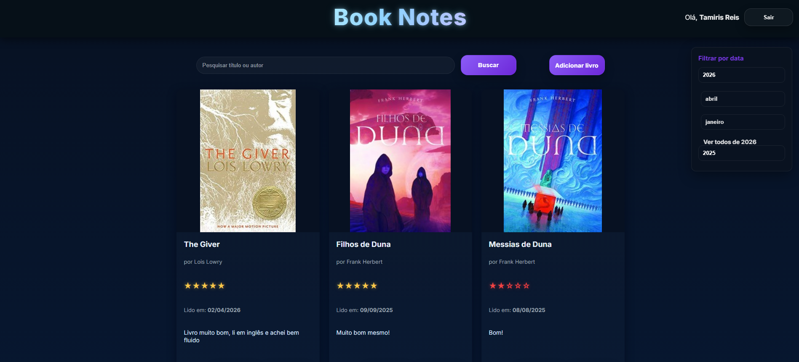
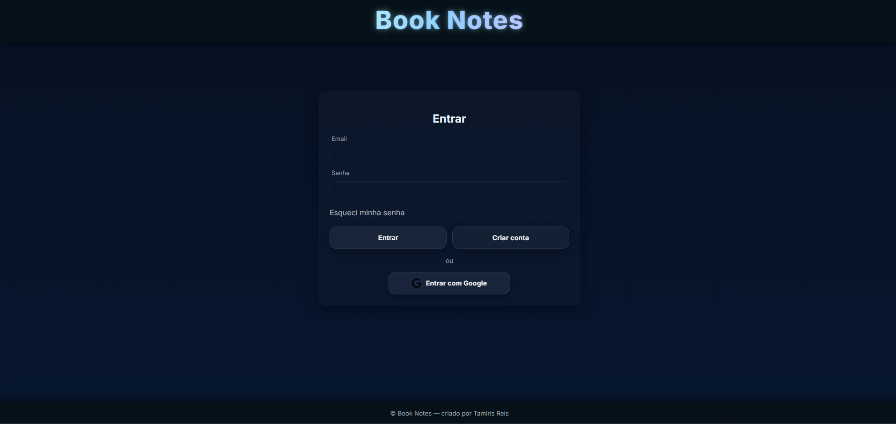
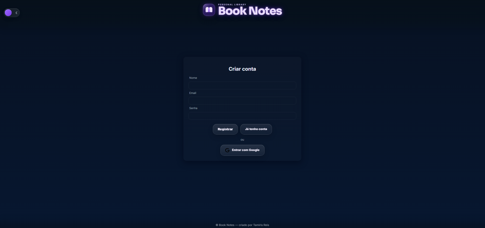
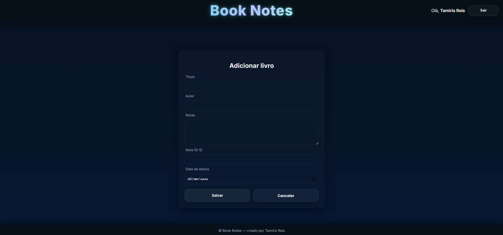
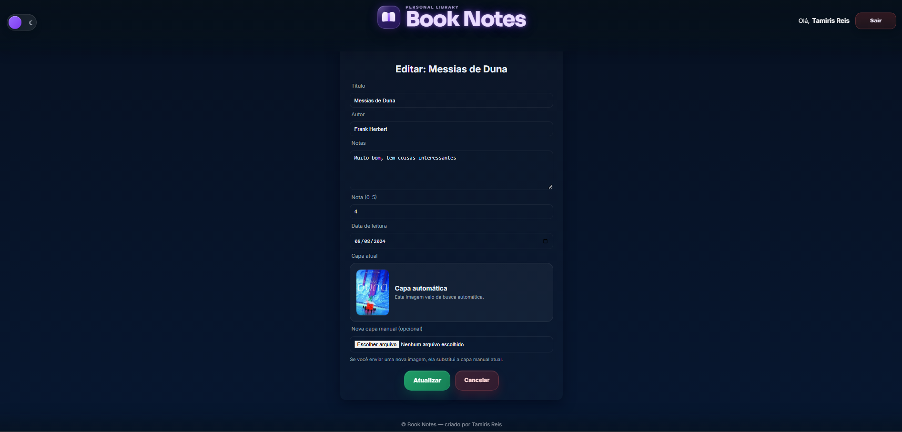
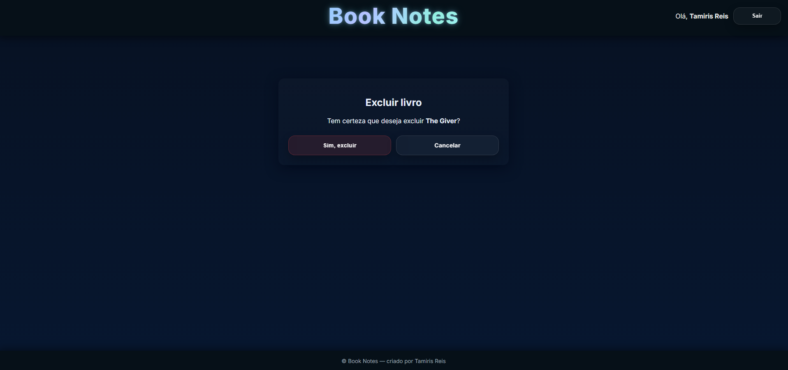
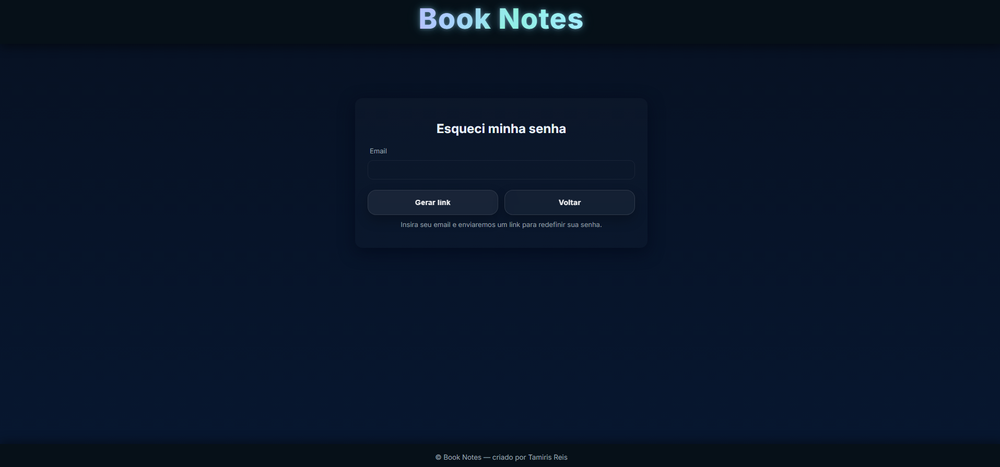

# BookNotes


BookNotes é uma aplicação web full-stack para acompanhar livros, anotações pessoais, avaliações e histórico de leitura.
Ela foi desenvolvida como projeto de portfólio para demonstrar habilidades de backend, autenticação, segurança, testes e deploy em produção com Node.js e PostgreSQL.

BookNotes is a full-stack web application for tracking books, personal notes, ratings, and reading history.
It was built as a portfolio project to demonstrate backend, authentication, security, testing, and production deployment skills with Node.js and PostgreSQL.

## Índice

- [PT-BR](#pt-br)
- [English](#english)

## PT-BR

### Demo

Aplicação online: https://book-notes-vvs0.onrender.com

Vídeo demo: `[]`

### Screenshots

Adicione aqui as capturas principais do projeto:

- Dashboard / home
- Login
- Cadastro
- Adicionar livro
- Editar livro
- Excluir livro
- Reset de senha

```md







```

### Funcionalidades

- Cadastro e login com email e senha
- Login com Google OAuth 2.0
- CRUD completo de livros
- Notas e avaliação por livro
- Filtros por data de leitura
- Paginação de livros na listagem principal, busca e filtros
- Upload manual de capa com fallback para capa automática
- Recuperação de senha por email
- Autenticação baseada em sessão
- Proteção CSRF em envios de formulário
- Rate limit em solicitações de redefinição de senha
- Sessões persistentes em produção
- Testes de integração cobrindo auth, reset e CRUD
- Testes E2E com Playwright
- CI com GitHub Actions rodando integração e E2E

### Stack Tecnológica

- Node.js
- Express.js
- EJS
- PostgreSQL
- Passport.js
- Express-session
- Cloudinary
- Multer
- Zod
- Nodemailer
- Winston
- Playwright
- GitHub Actions
- Render
- Neon

### Destaques de Segurança

- Hash de senha com `bcrypt`
- Token de reset armazenado com hash
- Autenticação baseada em sessão
- Proteção CSRF em requisições que alteram estado
- Rate limiting no fluxo de reset
- Variáveis de ambiente para dados sensíveis
- Persistência de sessão no PostgreSQL em produção

### Arquitetura

Visão geral da estrutura:

```text
.
├── app.js
├── index.js
├── db.js
├── routes/
│   ├── auth.js
│   └── books.js
├── services/
│   ├── authService.js
│   ├── bookService.js
│   ├── cloudinaryService.js
│   └── sessionStore.js
├── middleware/
│   ├── auth.js
│   ├── bookCoverUpload.js
│   └── csrf.js
├── validation/
│   └── schemas.js
├── views/
├── public/
├── e2e/
├── migrations/
└── tests/
    ├── integration.test.js
    └── support/
```

### Decisões Técnicas Principais

- Separação entre rotas, serviços, middlewares e validação
- Uso de PostgreSQL para persistência relacional e sessões em produção
- Fluxo seguro de redefinição de senha com token hasheado
- Validação centralizada com Zod
- Upload manual de capas com Cloudinary para funcionar bem em produção no Render
- Testes de integração sem depender do banco real de produção
- E2E com Playwright cobrindo os fluxos principais no navegador

### Testes

Para rodar a suíte de integração:

```bash
npm test
```

Para rodar os testes E2E com Playwright:

```bash
npm run test:e2e
```

Na primeira execução do Playwright, instale o navegador:

```bash
npx playwright install chromium
```

Atualmente os testes cobrem:

- fluxo de autenticação
- fluxo de recuperação de senha
- fluxo CRUD de livros
- paginação da listagem de livros
- fluxos E2E no navegador com Playwright

### Migrations do Banco

Este projeto usa migrations versionadas com `node-pg-migrate`.

Criar uma nova migration:

```bash
npm run migrate:create -- nome-da-migration
```

Executar migrations pendentes:

```bash
npm run migrate:up
```

Fazer rollback da última migration:

```bash
npm run migrate:down
```

A migration inicial cria:

- `users`
- `books`
- `user_sessions`

Migrations adicionais já incluídas no projeto:

- `002_add_manual_cover_url`
- `003_add_manual_cover_public_id`

### Como Rodar Localmente

#### Pré-requisitos

- Node.js 18+
- PostgreSQL
- Credenciais Google OAuth opcionais
- Credenciais SMTP opcionais, mas recomendadas para reset de senha

#### Instalação

```bash
git clone https://github.com/tamicoding/book-notes.git
cd book-notes
npm install
npm run migrate:up
```

#### Variáveis de Ambiente

Crie um arquivo `.env` na raiz:

```env
PORT=3000
NODE_ENV=development
DATABASE_URL=sua_url_postgres
SESSION_SECRET=sua_chave_de_sessao
BASE_URL=http://localhost:3000

GOOGLE_CLIENT_ID=seu_google_client_id
GOOGLE_CLIENT_SECRET=seu_google_client_secret
GOOGLE_CALLBACK_URL=http://localhost:3000/auth/google/callback

SMTP_HOST=seu_smtp_host
SMTP_PORT=587
SMTP_SECURE=false
SMTP_USER=seu_smtp_user
SMTP_PASS=sua_senha_smtp
SMTP_FROM=seu_email_remetente

CLOUDINARY_CLOUD_NAME=seu_cloud_name
CLOUDINARY_API_KEY=sua_api_key
CLOUDINARY_API_SECRET=seu_api_secret
```

#### Executar

```bash
npm run dev
```

A aplicação ficará disponível em:

```text
http://localhost:3000
```

### Rodando com Docker

Para subir a aplicação e o banco com Docker:

```bash
docker compose up --build
```

Esse setup sobe:

- a aplicação Node.js em `http://localhost:3000`
- um PostgreSQL em `localhost:5432`

Observações:

- o container da aplicação executa `npm run migrate:up` antes de iniciar
- o banco padrão no Docker é `booknotes`
- as credenciais padrão no Docker são `postgres/postgres`
- variáveis de Google OAuth, SMTP e Cloudinary ainda podem ser passadas pelo seu shell local ou `.env`
- os testes Playwright não dependem desse stack Docker porque usam um servidor isolado em memória

### Deploy

- Hospedagem da aplicação: Render
- Banco de dados: Neon PostgreSQL
- Upload de capas: Cloudinary
- Variáveis de ambiente configuradas no painel do Render
- Execute `npm run migrate:up` antes de iniciar a aplicação em um novo ambiente
- Para produção, configure também `CLOUDINARY_CLOUD_NAME`, `CLOUDINARY_API_KEY` e `CLOUDINARY_API_SECRET`

### Por Que Este Projeto é Relevante

Este projeto foi desenvolvido para demonstrar habilidades práticas valorizadas em entrevistas para backend e desenvolvimento web full-stack, especialmente:

- autenticação e autorização
- gerenciamento seguro de sessão
- segurança de formulários com CSRF
- validação de entrada
- integração com banco de dados
- deploy em produção
- testes automatizados
- mudanças versionadas de schema no banco

### Próximas Melhorias

- Tags ou categorias
- Dashboard de estatísticas de leitura
- Busca e filtros combinados mais avançados
- Refinos de UI/UX

### Autor

Desenvolvido por Tamiris como projeto de estudo e portfólio durante a transição de carreira para desenvolvimento de software.

LinkedIn: https://www.linkedin.com/in/tamirisfreis/

GitHub: https://github.com/tamicoding

---

## English

### Live Demo

Live application: https://book-notes-vvs0.onrender.com

Video demo: `[add demo video link here]`

### Screenshots

Add the main screenshots of the project here:

- Dashboard / home
- Login
- Register
- Add book
- Edit book
- Delete book
- Password reset

```md


```

### Features

- User registration and login with email and password
- Google OAuth 2.0 authentication
- Full CRUD for books
- Notes and rating per book
- Reading date filters
- Book pagination across main list, search, and date filters
- Manual cover uploads with automatic cover fallback
- Password recovery via email
- Session-based authentication
- CSRF protection for form submissions
- Rate limiting on password reset requests
- Persistent sessions in production
- Integration tests covering auth, reset password, and CRUD
- End-to-end browser tests with Playwright
- GitHub Actions CI running integration and E2E tests

### Tech Stack

- Node.js
- Express.js
- EJS
- PostgreSQL
- Passport.js
- Express-session
- Cloudinary
- Multer
- Zod
- Nodemailer
- Winston
- Playwright
- GitHub Actions
- Render
- Neon

### Security Highlights

- Password hashing with `bcrypt`
- Reset password tokens stored as hash
- Session-based authentication
- CSRF protection on state-changing requests
- Rate limiting on password reset
- Environment variables for sensitive credentials
- Persistent session storage in PostgreSQL for production

### Architecture

Project structure overview:

```text
.
├── app.js
├── index.js
├── db.js
├── routes/
│   ├── auth.js
│   └── books.js
├── services/
│   ├── authService.js
│   ├── bookService.js
│   ├── cloudinaryService.js
│   └── sessionStore.js
├── middleware/
│   ├── auth.js
│   ├── bookCoverUpload.js
│   └── csrf.js
├── validation/
│   └── schemas.js
├── views/
├── public/
├── e2e/
├── migrations/
└── tests/
    ├── integration.test.js
    └── support/
```

### Main Technical Decisions

- Separated routes, services, middleware, and validation layers to improve maintainability
- Used PostgreSQL for relational persistence and production session storage
- Implemented secure password reset flow with hashed tokens
- Centralized request validation with Zod
- Added Cloudinary-based manual cover uploads so production does not rely on ephemeral local storage
- Added integration tests without depending on the real production database
- Added Playwright E2E coverage for core browser flows

### Tests

Run the integration test suite:

```bash
npm test
```

Run Playwright end-to-end tests:

```bash
npm run test:e2e
```

First-time setup for Playwright browsers:

```bash
npx playwright install chromium
```

Current automated coverage includes:

- authentication flow
- password reset flow
- book CRUD flow
- paginated book list flow
- browser E2E flows with Playwright

### Database Migrations

This project uses versioned PostgreSQL migrations with `node-pg-migrate`.

Create a new migration:

```bash
npm run migrate:create -- migration-name
```

Run pending migrations:

```bash
npm run migrate:up
```

Rollback the last migration:

```bash
npm run migrate:down
```

The initial migration creates:

- `users`
- `books`
- `user_sessions`

Additional migrations currently included:

- `002_add_manual_cover_url`
- `003_add_manual_cover_public_id`

### Running Locally

#### Prerequisites

- Node.js 18+
- PostgreSQL
- Google OAuth credentials (optional)
- SMTP credentials (optional, but recommended for password reset emails)

#### Installation

```bash
git clone https://github.com/tamicoding/book-notes.git
cd book-notes
npm install
npm run migrate:up
```

#### Environment Variables

Create a `.env` file in the project root:

```env
PORT=3000
NODE_ENV=development
DATABASE_URL=your_postgres_url
SESSION_SECRET=your_session_secret
BASE_URL=http://localhost:3000

GOOGLE_CLIENT_ID=your_google_client_id
GOOGLE_CLIENT_SECRET=your_google_client_secret
GOOGLE_CALLBACK_URL=http://localhost:3000/auth/google/callback

SMTP_HOST=your_smtp_host
SMTP_PORT=587
SMTP_SECURE=false
SMTP_USER=your_smtp_user
SMTP_PASS=your_smtp_password
SMTP_FROM=your_from_email

CLOUDINARY_CLOUD_NAME=your_cloud_name
CLOUDINARY_API_KEY=your_api_key
CLOUDINARY_API_SECRET=your_api_secret
```

#### Start the Application

```bash
npm run dev
```

Application URL:

```text
http://localhost:3000
```

### Running with Docker

Start the full stack with Docker:

```bash
docker compose up --build
```

This setup starts:

- the Node.js application on `http://localhost:3000`
- a PostgreSQL database on `localhost:5432`

Notes:

- the application container runs `npm run migrate:up` before starting
- the default Docker database is `booknotes`
- the default Docker credentials are `postgres/postgres`
- Google OAuth, SMTP, and Cloudinary variables can still be passed from your local shell or `.env`
- Playwright tests do not depend on this Docker stack because they use an isolated in-memory test server

### Deployment

- Application hosting: Render
- Database hosting: Neon PostgreSQL
- Cover upload hosting: Cloudinary
- Environment variables configured in the Render dashboard
- Run `npm run migrate:up` before starting the app in a new environment
- In production, also configure `CLOUDINARY_CLOUD_NAME`, `CLOUDINARY_API_KEY`, and `CLOUDINARY_API_SECRET`

### Why This Project Matters

This project was built to demonstrate practical full-stack development skills expected in junior and mid-level backend/web interviews, especially:

- authentication and authorization
- secure session handling
- form security with CSRF
- input validation
- database integration
- production deployment
- automated testing
- versioned database schema changes

### Future Improvements

- Tags or categories
- Reading statistics dashboard
- More advanced combined filters and search UX
- UI/UX refinements

### Author

Developed by Tamiris as a portfolio and study project during a career transition into software development.

LinkedIn: https://www.linkedin.com/in/tamirisfreis/

GitHub: https://github.com/tamicoding
